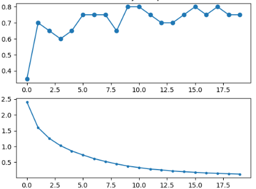
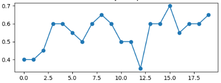
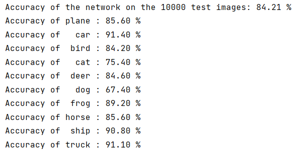

代码中对三种网络结构进行了训练，分别为2卷积层3全连接层的CNN，AlexNet， VGG-16，
并在测试过程中观察调整优化器，加入衰减参数，加入失活操作等对网络识别率的影响

下面对代码运行进行介绍：
# 数据集
首先使用 torchvision加载和归一化cifar10的训练数据和测试数据。
torchvision中实现了常用的一些深度学习的相关的图像数据的加载功能，比如cifar10、Imagenet、Mnist等等的，保存在torchvision.datasets模块中。

导入数据集一共包含10个类别，分别为：

    classes = ('plane', 'car', 'bird', 'cat', 'deer', 'dog', 'frog', 'horse', 'ship', 'truck')

一共包含60000幅32x32彩色图像，每个类6000幅图像。训练图像50000张，测试图像10000张。
该数据集被分为5个训练批和1个测试批，每个批包含10000张图像。

# 网络结构
一共使用了三种网络结构，具体代码在network.py中，分别为2卷积层3全连接层的CNN，AlexNet，VGG-16，
同时因为AlexNet 的输入图像为（224*224）大小的，如果按照原始的AlexNet的参数进行训练，
在池化的时候会出现图像过小的问题， 因此对其网络结构进行了修改

## 参数设置
    batch_size = 4 
    epoches = 20
    optimizer = SGD(lr=0.001, momentum=0.9)
    loss = CrossEntropyLoss

## 测试结果

| Network      | CNN        | AlexNet   | VGG16       |
|--------------|------------|-----------|-------------|
| accuracy/%   | 60.05      | 77.69     | 81.85       |
| time(/epoch) | 1m14s      | 2m1s      | 4m16s       |
| worst class  | dog-40.80% | cat-52.80 | cat-67.80   |
| best class   | car-81.50% | car-90.00 | horse-92.20 |

## 总结
根据当下的趋势，网络结构往往向着越来越深，越来越复杂的方向发展，可以从上表的结果看出虽然网络识别率提高了，
但每个epoch所需要的时间也越来越长了，对比AlexNet和VGG-16的结果，在识别率仅提高4%时每个epoch所需时间
翻了一倍，对硬件的要求不断提高也是限制深度学习发展的一个重要因素，因此如何在提取有效特征和效率之间达到平衡
是很重要的。

# 优化器
优化器决定了网络参数的更新方式，对模型的有效性有非常大的影响，从SGD开始也不断有学者提出不同的优化算法，
这些优化算法所针对的情景和运用的算法不尽相同，因此在实际情况下应该选择哪一种优化算法还需要进行实际的测试。
在实际运用中Adam算法一般能表现良好的性能，因为同时结合了一阶动量与二阶动量常常优于其他优化算法，
同时还有一个很重要的概念是衰减参数weight_decay，如果学习率是一成不变的，那么当模型逐渐拟合
于结果时可能会出现震荡的情况，因此在接近结果后希望能够降低学习率，所以设定一定的衰减率也是非常重要的。

下表展示了使用Adam优化器及加入weight_decay之后的模型性能，同时附上了VGG-16在Adam+weight_decay
下的训练过程中accuracy和loss的增长趋势，可以看出模型的变化速率逐渐变缓避免了震荡的情况。

| Network |  | CNN | AlexNet | VGG-16 |
| --- | --- | --- | --- | --- |
| Accuracy/% | SGD | 60.05 | 77.69 | 81.85 |
|  | Adam | 60.33 | 77.55 | 83.05 |
|  | Adam+weight-decay | 62.05 | 78.52 | 84.46 |

## 学习率的选择
因为网络模型和更新参数方式的改变，学习率也需要进行相应的更改，过大的学习率会导致出现模型震荡，难以拟合
到最优点，学习率过小会导致模型优化速度缓慢，并且导致陷入局部最优点。下图展示了AlexNet模型在改用Adam
优化器后使用和SGD相同的学习率(1e-3)导致的震荡情况，明显属于学习率过大情况，且模型在测试集上的识别率
仅有70.57%，调整学习率为1e-4后识别准确率显著的提高了。

# 运行
已经将测试结果显示为最优的一个模型保存在model.pth中，直接在命令行中输入

    python test.py

即可运行代码并可视化结果

